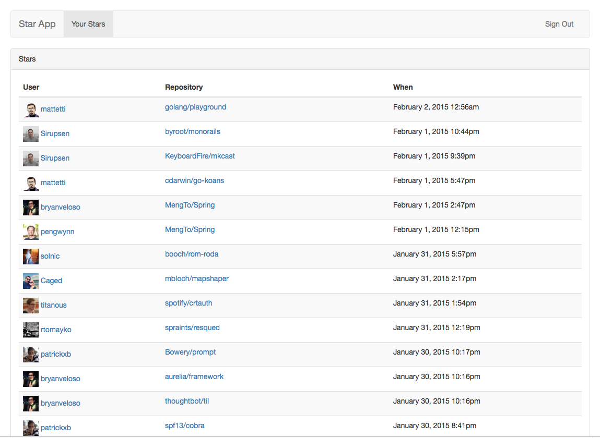

# Stars

Collects github.com stars from people you follow. Not much to see right now though.



## Setup

```
# setup env file from example, don't forget to update .env with github oauth
# app key and secret
mv .env.example .env

# bundle this bad boy
script/bootstrap

# setup the db for dev and test
bin/rake db:create db:migrate db:test:prepare

# run the server and open in browser
script/server
open http://localhost:3000

# or run the tests
script/test
```

## Heroku Setup

* Create app on heroku
* [Register](https://github.com/settings/applications/new) GitHub app; be sure to set authorization callback url to your heroku url
* Set github key and secret from GitHub oauth app on heroku: `heroku config:set GITHUB_KEY=... GITHUB_SECRET=... -a <your app name>`
* Deploy to heroku
* Run migrations `heroku run rake db:migrate -a <your app name>`
* Add [heroku scheduler](https://addons.heroku.com/scheduler) and setup `bundle exec rake import` to run on whatever interval you want
